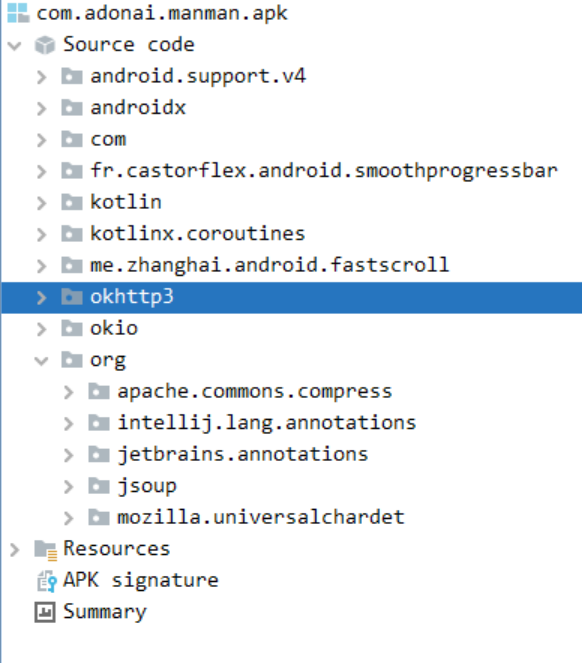
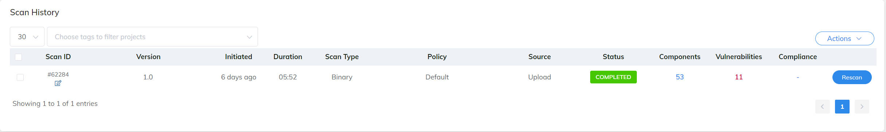
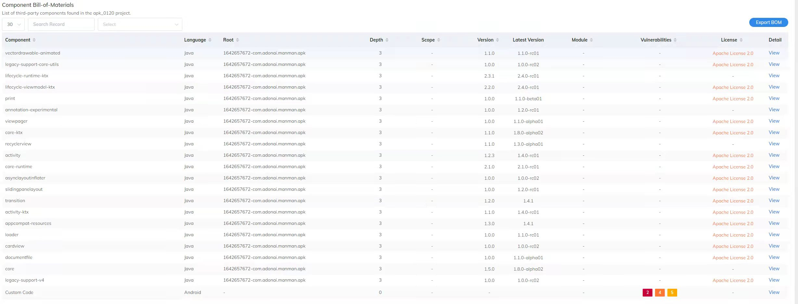
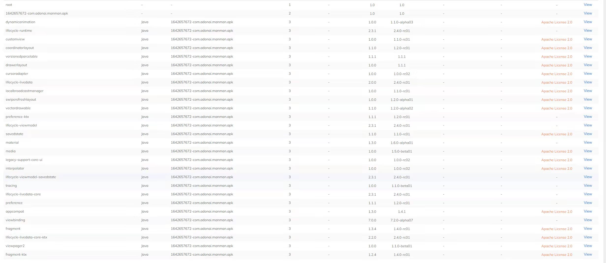
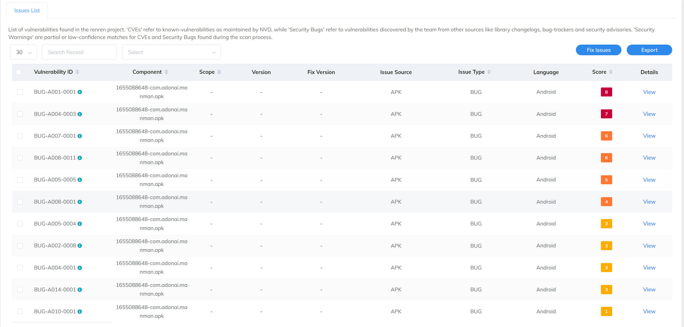

# PHunter

This is a supplementary repository for paper submission "**Precise and Efficient Patch Presence Test for Android Applications against Code Obfuscation**". It introduces PHunter, which is a precise and efficient patch presence test tool for Android applications against code obfuscation, including identifier renaming, package flattening, control flow randomization, and dead code removal. PHunter does not rely on debug information and uses fine-grained anti-obfuscation semantic information for patch status determination compared to other tools.

This repository currecntly contains the supplementary information of the paper, the source and artifact of PHunter, 8 samples test cases, and other necessary instructions to run PHunter.

**Be noted that we will release the complete dataset once the paper is accepted.**

## Artifact usage

The artifact is [PHunter.jar](PHunter.jar) and all required dependencies are already included.
The sampled dataset with groundtruth is located at the folder: [samples](./samples).  

You can also build the source code using maven, and the artifact is located at `target/PHunter-1.1-jar-with-dependencies.jar`:
The java version should be 8 or 11 currently, using java 17 will encounter a NullPointerException.
```
$ mvn clean compile assembly:single
```


PHunter currently provides two examples for testing, each containing two TPLs (pre-patch/post-patch), five apps (non-obfuscated, proguard-obfuscated, dasho-obfuscated, allatori-obfuscated and obfuscapk-obfuscated), the corresponding CVE patch file and four mapping files generated by obfuscation tools. The mapping file records the mapping between origin identifiers and the renamed identifiers. One can refer to the mapping file to check whether the patch related methods are renamed or deleted during obfuscation.  

To use PHunter, users should have pre-patch and post-patch third-party libraries(.jar/.aar), patch files(.diff), and app(.apk) to be tested.

```
$ java -jar PHunter.jar --help
usage: help [-output <arg>] [-preTPL <arg>] [-enableDebug] [-postTPL <arg>] [-targetAPK <arg>]
       [-patchFiles <arg>] [-androidJar <arg>] [-threadNum <arg>] [-?]

-targetAPK <arg>    Path to pre-patched binary(.apk), or a directory containsmulti apks
-preTPL <arg>    Path to pre-patched binary(.jar/.aar)
-postTPL <arg>   Path to post-patched binary(.jar/.aar)
-?,--help           Print this help message
-androidJar <arg>   The path to android.jar
-enableDebug        Is enable debug level
-patchFiles <arg>   Path to patch files, if exist more than 1 files, split by the ';’ (e.g., "1.diff;2.diff")
-threadNum <arg>    The number of threads to use
```

### Example

```
$ java -jar ./PHunter.jar --preTPL samples/sample1/commons-compress-CVE-2018-1324-pre.jar --postTPL samples/sample1/commons-compress-CVE-2018-1324-post.jar --threadNum 10 --androidJar ./android-31/android.jar --patchFiles samples/sample1/CVE-2018-1324_2a2f1dc48e22a34ddb72321a4db211da91aa933b.diff --targetAPK samples/sample1/com.greenaddress.abcore.apk
```

The output will be shown in the terminal, which means the CVE patch is PRESENT in the target app:

```
[main] INFO analyze.BinaryAnalyzer - Analyzing the pre-patched binary samples/sample1/commons-compress-CVE-2018-1324-pre.jar
Soot started on Fri Nov 18 01:08:28 CST 2022
Soot finished on Fri Nov 18 01:08:43 CST 2022
Soot has run for 0 min. 15 sec.
[main] INFO analyze.BinaryAnalyzer - Analyzing the post-patched binary samples/sample1/commons-compress-CVE-2018-1324-post.jar
Soot started on Fri Nov 18 01:08:44 CST 2022
Soot finished on Fri Nov 18 01:08:58 CST 2022
Soot has run for 0 min. 14 sec.
[main] INFO analyze.ParsePatchFiles - Analyzing the patch samples/sample1/CVE-2018-1324_2a2f1dc48e22a34ddb72321a4db211da91aa933b.diff
[main] INFO analyze.APKAnalyzer - Analyzing the apk samples/sample1/com.greenaddress.abcore.apk
Soot started on Fri Nov 18 01:08:59 CST 2022
Soot finished on Fri Nov 18 01:09:06 CST 2022
Soot has run for 0 min. 7 sec.
patch-related method count = 1
[main] INFO analyze.PatchPresentTest_new - The matched pairs for pre-patch TPL and APP are:
[main] INFO analyze.PatchPresentTest_new - <org.apache.commons.compress.archivers.zip.X0017_StrongEncryptionHeader: void parseCentralDirectoryFormat(byte[],int,int)>   <org.apache.commons.compress.archivers.zip.X0017_StrongEncryptionHeader: void parseCentralDirectoryFormat(byte[],int,int)>      0.843125
[main] INFO analyze.PatchPresentTest_new - The matched pairs for post-patch TPL and APP are:
[main] INFO analyze.PatchPresentTest_new - <org.apache.commons.compress.archivers.zip.X0017_StrongEncryptionHeader: void parseCentralDirectoryFormat(byte[],int,int)>   <org.apache.commons.compress.archivers.zip.X0017_StrongEncryptionHeader: void parseCentralDirectoryFormat(byte[],int,int)>      0.888264
[main] INFO analyze.PatchPresentTest_new - the patch IS PRESENT, pre similarity=0.843125        post similarity=0.888264
```
## Supplementary Information

### **Tree Structure**

Based on the Backus-Naur Form (BNF) of Jimple, we define the ExprType, Data of the Tree Structure in the tool.
|ExprType|Data|Children|Example|
|---|---|---|---|
|Comparator|Comparator Symbols|two tree nodes, representing the left and right operands|">", ">=", "==", "!=", etc |
|BinOperator|Binary Operators|two tree nodes, representing the left and right operands|"+", "-", "*", "/",etc|
|UnaryOperator|Unary operators|one tree node, representing the operand|"lengthof", "-"(negative sign)|
|InstanceOf|Specific class name|one tree node, representing the instance|Suppose a statement is "v instanceof MyClass", and its Data is "MyClass"|
|Invoke|Return type and parameter types|several tree nodes, representing the individual parameter variables|suppose a framework function "boolean startsWith(String a)" is called, its Data is "boolean,String"|
|Array|Base Type of the array|one tree node, representing the size of the array|a new array with long type as the base type, its Data form is "long"|
|Constant|Constant types with values|-|suppose a long type constant with value 15, its Data is represented as "long#15"|
|Class|Name of a class|-|"MyClass"|
|Parameter|Index of target method's parameters|-|suppose the prototype of the target method is "public void fun(MyClass p1, int p2)", then p1 is "1", p2 is "2"|
|Field|DeclaringClass with types|-|suppose a long type field declared in the MyClass.java, its Data form is "MyClass\#long"|
|CaughtException|An unique string for CaughtException|-|“@caughtexception”|

<!-- |MultiArray|Type of the multiarray|several tree nodes, representing the size of each dimension|suppose a statement is "a[0] = new int[3][3]", its Data is "int[][]"| -->

### **Obfuscation Strategies**
- ``Code Shrinking``: removing unused code to reduce the size of programs.

- `Package Flattening`: breaking the original structure of the code hierarchy and repackaging classes from multiple packages into one.

- `Identifier Renaming`: renaming packages, classes, methods, and variables. For example, identifiers can be renamed into meaningless characters such as ``x`` and ``y``.

- `Control Flow Obfuscation`: modifying the original Control Flow Graph (CFG) by inserting redundant control flows, variables and function calls, thus significantly increasing the difficulty of the reverse analysis while preserving the original semantics.

- `String Encryption`: encrypting strings that appear in the code as meaningless strings. It protects sensitive information in the code, such as keys, email addresses, etc.


### The re-implementation of BinXray
[BinXray](https://sites.google.com/view/submission-for-issta-2020) was originally designed for C/C++ and implemented in Python.
Fortunately, we can re-use the main code of BinXray, which differs only in pre-processing phase (i.e., extract binary instructions) while the other part of code are directly re-uesd. Specifically, we first convert TPLs from ``.jar`` to ``.dex`` using [dx](https://developer.android.com/studio/releases/platform-tools). We then utilize [Androguard](https://github.com/androguard/androguard) to extract the Dalvik instructions from TPLs (``.dex``) and the app (``.apk``).
In BinXray' desigin, it should normalize each assembly instruction in pre-processing phase (e.g replacing indirect ``memory access`` by a symbolic term ``mem``). However, Dalvik bytecode does not have such ``memory access``. Therefore, we just extract the opcode from each Dalvik instruction such as ``invoke-direct``. This idea is as same as ATVHunter, which extracts the opcode from Dalvik instruction to construct method signature.
The re-implemented BinXray achieves excellent results for unobfuscated apps (see Table 3), demonstrating the validity of our implementation.


### **Dataset**

We crawled 4,561 open-source apps from F-Droid, a repository for open-source Android apps. By parsing the Gradle build files, we recognize all the libraries used by each app and then collect the reported vulnerabilities and the corresponding affected versions for each library by querying NVD. Finally, we collected 94 CVEs which affect 31 distinct common libraries (we count org.eclipse.jetty:jetty-X as one library category so the total TPL number is 31) after spending huge manual efforts. 
The selected CVEs in this work are listed as follow.
| library (group:artifact) | CVE |
| --- | --- |
|com.neovisionaries:nv-websocket-client | CVE-2017-1000209 |
|FasterXML:jackson-dataformat-xml |CVE-2016-3720|
|org.jsoup:jsoup|                              CVE-2015-6748|
|org.apache.groovy:groovy|                     CVE-2015-3253, CVE-2016-6814|
|org.igniterealtime.smack:smack-core|          CVE-2016-10027|
|com.thoughtworks.xstream:xstream|             CVE-2013-7285, CVE-2017-7957|
|org.apache.commons:commons-compress|          CVE-2018-11771, CVE-2019-12402<br>CVE-2018-1324,CVE-2012-2098|
|com.squareup.okhttp3:okhttp|                  CVE-2021-0341|
|org.apache.httpcomponents:httpclient|         CVE-2015-5262, CVE-2014-3577|
|com.itextpdf:itextpdf|                        CVE-2017-9096|
|com.github.junrar:junrar|                            CVE-2018-12418 |
|com.google.guava:guava|                       CVE-2018-10237 |
|com.caverock:androidsvg|                      CVE-2017-1000498|
|io.netty:netty|                               CVE-2018-12418, CVE-2014-0193<br>CVE-2016-4970, CVE-2014-3488|
|com.squareup.retrofit2:retrofit|              CVE-2018-1000850|
|org.zeroturnaround:zt-zip|                    CVE-2018-1002201|
|ch.qos.logback:logback-core|                  CVE-2017-5929|
|org.apache.jackrabbit:jackrabbit-webdav|      CVE-2015-1833, CVE-2016-6801|
|org.conscrypt:conscrypt-android|              CVE-2017-13309|
|org.apache.logging.log4j:log4j-core|          CVE-2021-44228, CVE-2021-45046<br>CVE-2017-5645|
|org.apache.pdfbox:pdfbox|                     CVE-2016-2175, CVE-2018-8036<br>CVE-2018-11797,CVE-2019-0228|
|com.fasterxml.jackson.core:jackson-databind|  CVE-2019-17267, CVE-2020-8840<br>CVE-2021-20190, CVE-2019-14439<br>CVE-2018-11307, CVE-2019-14892<br>CVE-2020-36182, CVE-2018-19362<br>CVE-2018-19360, CVE-2019-14893<br>CVE-2017-17485, CVE-2018-5968<br>CVE-2019-12086, CVE-2018-12022<br>CVE-2018-19361,CVE-2020-9546<br>CVE-2019-12814|
org.bouncycastle:bcprov-jdk15on|              CVE-2016-1000344, CVE-2016-1000341<br>CVE-2020-26939, CVE-2016-1000343<br>CVE-2018-1000613, CVE-2016-1000352<br>CVE-2016-1000345, CVE-2018-1000180<br>CVE-2020-28052, CVE-2016-1000346 <br>CVE-2019-17359, CVE-2017-13098 <br>CVE-2016-1000342,CVE-2015-6644<br>CVE-2016-1000339 ,CVE-2016-1000338|
|org.eclipse.jetty:jetty-server |CVE-2011-4461, CVE-2016-4800 <br>CVE-2018-12538,CVE-2019-17632<br>CVE-2019-10247,CVE-2019-10241|
|org.eclipse.jetty:jetty-servlet|CVE-2019-10246|
|org.eclipse.jetty:jetty-security|CVE-2017-9735|
|org.eclipse.jetty:jetty-http|CVE-2015-2080,CVE-2017-7656<br>CVE-2017-7657|
|dom4j:dom4j|CVE-2020-10683,CVE-2018-1000632|
|io.netty:netty-all |CVE-2019-16869,CVE-2015-2156<br>CVE-2019-20444|
|org.apache.openjpa:openjpa-lib|CVE-2013-1768|
|com.unboundid:unboundid-ldapsdk|CVE-2018-1000134|
|commons-beanutils:commons-beanutils|CVE-2019-10086|
|org.apache.cordova:framework|CVE-2015-5256,CVE-2015-8320|
|com.liulishuo.filedownloader:library|CVE-2018-11248|

<!-- ### **About ATVHunter**  

**[com.adonai.manman.apk](samples/sample9/com.adonai.manman.apk)** in sample7 contains org.jsoup:jsoup:1.12.1, org.apache.commons:commons-compress:1.13 and com.squareup.okhttp3:okhttp:4.9.0.  
<div align="center">

</div>

We tried the online trial [sites](https://scantist.io) given in the paper: **ATVHunter: Reliable Version Detection of Third-Party Libraries for Vulnerability Identification in Android Applications**. The website reports that the app has 53 components and 11 vulnerablities, but the above 3 TPLs are not present among them. The following figures show the report on the website.
<div>
<div> The overview is:
              
       </div>
       <div>
       The reported 53 components are:
              
       </div>
       <div>
              
       </div>
       <div>
       The reported 11 vulnerablities are:
              
       </div>
</div>
<br/>
<br/>
We also uploaded all 100 apps from dataset_1 to the site and the results are shown in Table 1  

<div align=center>Table 1. Comparison with ATVHunter</div>

| Tools | No Obfuscation(Acc) |Proguard(Acc) | DashO(Acc) | 
|:------:|:---------:|:---------:|:---------:|
|PHunter|98.4%|92.9%|93.3%|
|ATVHunter|0%|0%|0%|

We confirmed with the authors that provided service might be problematic since they are commercializing it on the current moment. Therefore, we excluded the experimental results in our paper to avoid unfair comparisons. -->
