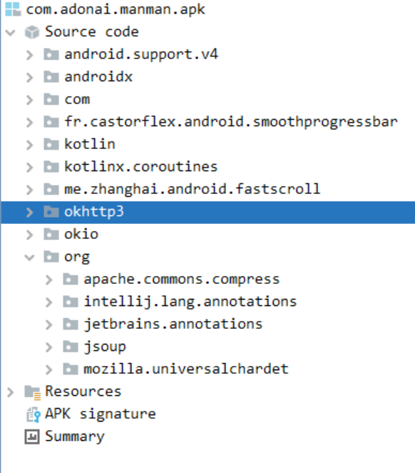
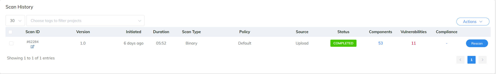
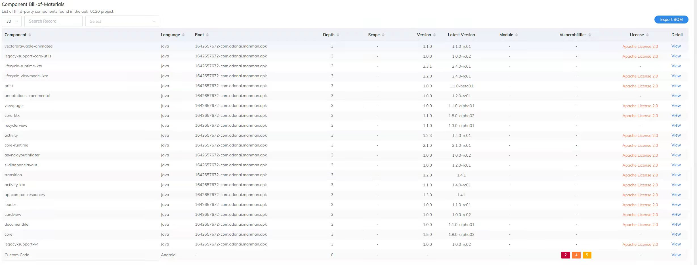
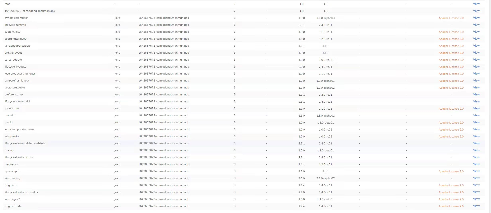
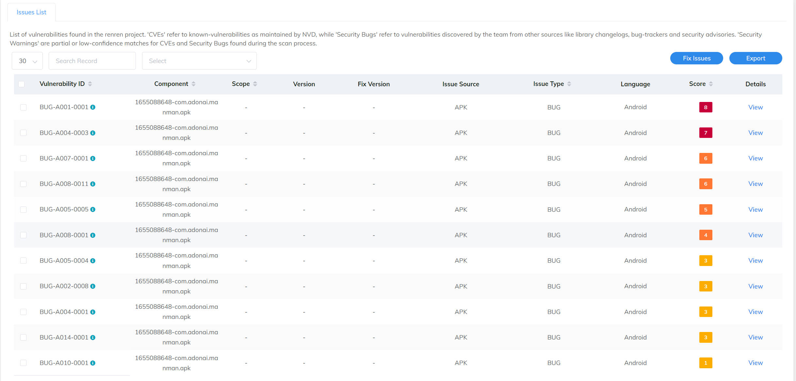

# PHunter

This is a supplementary repository for paper submission "**Precise and Efficient Patch Presence Test for Android Applications against Code Obfuscation**". It introduces PHunter, which is a precise and efficient patch presence test tool for Android applications against code obfuscation, including identifier renaming, package flattening, control flow randomization, and dead code removal. PHunter does not rely on debug information and uses fine-grained anti-obfuscation semantic information for patch status determination compared to other tools.

This repository currecntly contains the supplementary information of the paper, the binary version of PHunter, 10 samples test cases, and other necessary instructions to run PHunter.

**Be noted that we will open source PHunter, and release the complete dataset once the paper is accepted.**

## Artifact usage

The artifact is [PHunter.jar](PHunter.jar) and all required dependencies are already included.
The sampled dataset with groundtruth is located at the folder: [samples](./samples).  

PHunter currently provides two examples for testing, each containing two TPLs (pre-patch/post-patch), three apps (proguard-obfuscated, dasho-obfuscated, origin),  two mapping files generated by obfuscation tools and the corresponding patch file.  

To use PHunter, users should have pre-patch and post-patch third-party libraries(.jar/.aar), patch files(.diff), and app(.apk) to be tested.

```
$ java -jar PHunter.jar
usage: help [-output <arg>] [-preTPL <arg>] [-enableDebug] [-postTPL <arg>] [-targetAPK <arg>]
       [-patchFiles <arg>] [-androidJar <arg>] [-threadNum <arg>] [-?]

-targetAPK <arg>    Path to pre-patched binary(.apk), or a directory containsmulti apks
-preTPL <arg>    Path to pre-patched binary(.jar/.aar)
-postTPL <arg>   Path to post-patched binary(.jar/.aar)
-?,--help           Print this help message
-androidJar <arg>   The path to android.jar
-enableDebug        Is enable debug level
-patchFiles <arg>   Path to patch files, if exist more than 1 files, split by the ';’ (e.g., "1.diff;2.diff")
-threadNum <arg>    The number of threads to use
```

### Example

```
java -jar ./PHunter.jar --preTPL samples/sample1/commons-compress-CVE-2018-1324-pre.jar --postTPL samples/sample1/commons-compress-CVE-2018-1324-post.jar --threadNum 10 --androidJar ./android-31/android.jar --patchFiles samples/sample1/CVE-2018-1324_2a2f1dc48e22a34ddb72321a4db211da91aa933b.diff --targetAPK samples/sample1/com.greenaddress.abcore.apk
```

## Supplementary Information

### **Tree Structure**

Based on the Backus-Naur Form (BNF) of Jimple, we define the ExprType, Data of the Tree Structure in the tool.
|ExprType|Data|Children|Example|
|---|---|---|---|
|Comparator|Comparator Symbols|two tree nodes, representing the left and right operands|">", ">=", "==", "!=", etc |
|BinOperator|Binary Operators|two tree nodes, representing the left and right operands|"+", "-", "*", "/",etc|
|UnaryOperator|Unary operators|one tree node, representing the operand|"lengthof", "-"(negative sign)|
|InstanceOf|Specific class name|one tree node, representing the instance|Suppose a statement is "v instanceof MyClass", and its Data is "MyClass"|
|Invoke|Return type and parameter types|several tree nodes, representing the individual parameter variables|suppose a framework function "boolean startsWith(String a)" is called, its Data is "boolean,String"|
|Array|Base Type of the array|one tree node, representing the size of the array|a new array with long type as the base type, its Data form is "long"|
|Constant|Constant types with values|-|suppose a long type constant with value 15, its Data is represented as "long#15"|
|Class|Name of a class|-|"MyClass"|
|Parameter|Index of target method's parameters|-|suppose the prototype of the target method is "public void fun(MyClass p1, int p2)", then p1 is "1", p2 is "2"|
|Field|DeclaringClass with types|-|suppose a long type field declared in the MyClass.java, its Data form is "MyClass\#long"|
|CaughtException|An unique string for CaughtException|-|“@caughtexception”|

<!-- |MultiArray|Type of the multiarray|several tree nodes, representing the size of each dimension|suppose a statement is "a[0] = new int[3][3]", its Data is "int[][]"| -->

### **Dataset**

We crawled 4,561 open-source apps from F-Droid, a repository for open-source Android apps. By parsing the Gradle build files, we recognize all the libraries used by each app and then collect the reported vulnerabilities and the corresponding affected versions for each library by querying NVD. Finally, we collected 60 CVEs which affect 22 distinct common libraries after spending huge manual efforts.
The selected CVEs in this work are listed as follow.
| library | CVE |
| --- | --- |
|org.jsoup:jsoup|                              CVE-2015-6748|
|org.apache.groovy:groovy|                     CVE-2015-3253, CVE-2016-6814|
|org.igniterealtime.smack:smack-core|          CVE-2016-10027|
|com.thoughtworks.xstream:xstream|             CVE-2013-7285, CVE-2017-7957|
|org.apache.commons:commons-compress|          CVE-2018-11771, CVE-2019-12402<br>CVE-2018-1324|
|com.squareup.okhttp3:okhttp|                  CVE-2021-0341|
|org.apache.httpcomponents:httpclient|         CVE-2015-5262, CVE-2014-3577|
|com.itextpdf:itextpdf|                        CVE-2017-9096|
|com.github.junrar:junrar|                            CVE-2018-12418 |
|com.google.guava:guava|                       CVE-2018-10237 |
|com.caverock:androidsvg|                      CVE-2017-1000498|
|io.netty:netty|                               CVE-2018-12418, CVE-2014-0193<br>CVE-2016-4970, CVE-2014-3488|
|com.squareup.retrofit2:retrofit|              CVE-2018-1000850|
|org.zeroturnaround:zt-zip|                    CVE-2018-1002201|
|ch.qos.logback:logback-core|                  CVE-2017-5929|
|org.apache.tika:tika-parsers|                 CVE-2019-10093, CVE-2016-6809<br>CVE-2018-8017, CVE-2018-17197|
|org.apache.jackrabbit:jackrabbit-webdav|      CVE-2015-1833, CVE-2016-6801|
|org.conscrypt:conscrypt-android|              CVE-2017-13309|
|org.apache.logging.log4j:log4j-core|          CVE-2021-44228, CVE-2021-45046|
|org.apache.pdfbox:pdfbox|                     CVE-2016-2175, CVE-2018-8036<br>CVE-2018-11797|
|com.fasterxml.jackson.core:jackson-databind|  CVE-2019-17267, CVE-2020-8840<br>CVE-2021-20190, CVE-2019-14439<br>CVE-2018-11307, CVE-2019-14892<br>CVE-2020-36182, CVE-2018-19362<br>CVE-2018-19360, CVE-2019-14893<br>CVE-2017-17485, CVE-2018-5968<br>CVE-2019-12086, CVE-2018-12022<br>CVE-2018-19361|
org.bouncycastle:bcprov-jdk15on|              CVE-2016-1000344, CVE-2016-1000341<br>CVE-2020-26939, CVE-2016-1000343<br>CVE-2018-1000613, CVE-2016-1000352<br>CVE-2016-1000345, CVE-2018-1000180<br>CVE-2020-28052, CVE-2016-1000346  

### **About ATVHunter**  

**[com.adonai.manman.apk](samples/sample9/com.adonai.manman.apk)** in sample7 contains org.jsoup:jsoup:1.12.1, org.apache.commons:commons-compress:1.13 and com.squareup.okhttp3:okhttp:4.9.0.  
<div align="center">

</div>

We tried the online trial [sites](https://scantist.io) given in the paper: **ATVHunter: Reliable Version Detection of Third-Party Libraries for Vulnerability Identification in Android Applications**. The website reports that the app has 53 components, but the above 3 TPLs are not present among them. The following figures show the report on the website.
<div>
<div> The overview is:
              
       </div>
       <div>
       The reported 53 components are:
              
       </div>
       <div>
              
       </div>
       <div>
       The reported 11 Vulnerablities are:
              
       </div>
</div>
<br/>
<br/>
We also uploaded all 100 apps from dataset_1 to the site and the results are shown in Table 1  

<center>Table 1. Comparison with ATVHunter</center>

| Tools | No Obfuscation(Acc) |Proguard(Acc) | DashO(Acc) | 
|:------:|:---------:|:---------:|:---------:|
|PHunter|98.4%|92.9%|93.3%|
|ATVHunter|0%|0%|0%|

We confirmed with the authors that provided service might be problematic since they are commercializing it on the current moment. Therefore, we excluded the experimental results in our paper to avoid unfair comparisons.
